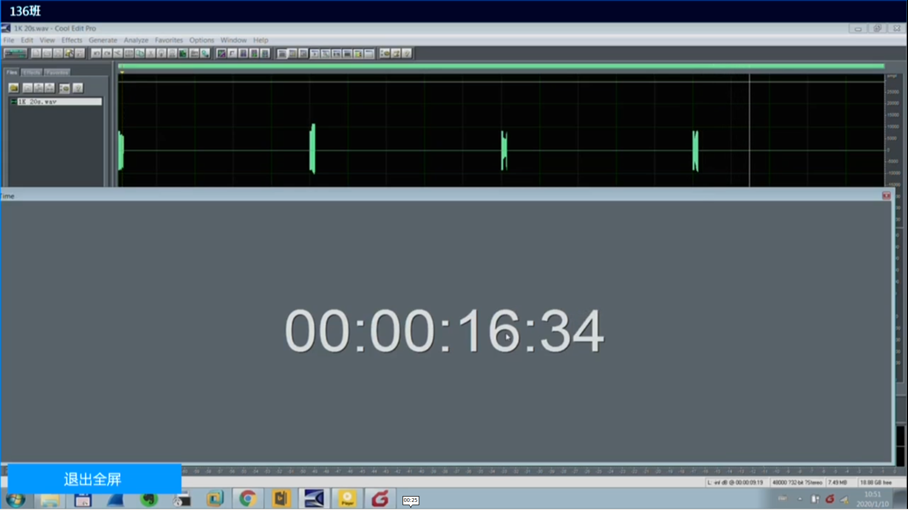

## 使用
python3 av_sync.py mp4file audio_frame_size audio_filter_val thread_num n_diagnosis_frames audio_time_interval

* 说明:
  mp4file               :        是输入的mp4文件，这个是必须指定的参数，其他都是可选的。
  audio_frame_size      :        音频帧的长度，默认是20毫秒
  audio_filter_val      :        用于短时能量的过滤，小于这个值的能量都会被抛弃，默认是100000000000
  thread_num            :        用于计算短时能量的线程数
  n_diagnosis_frames    :        诊断视频画面中时间戳所需的帧数量，默认是3帧
  audio_time_interval   :        音频报时的时间间隔，对于这个音频是5000毫秒

* 用例:
  python3 av_sync.py input.mp4
  python3 av_sync.py input.mp4 20 100000000000 4 3 5000

* 输出结果的说明:
  如果出现视频画面无法识别的情况，那么会在当前目录产生一个err_log文件以及err_img文件。
  对于生成的延时图，如果其延时线为红色，则说明该时间点的视频画面无法识别

* 运行程序所需要的依赖
  1. ffmpeg(c语言库)
  2. cv2(python库)
  3. tesseract4.0
  4. pytesseract(python库)
  5. matplotlib(python库)

* 其他注意事项:
  在视频录制的时候，请保证视频画面中时间的显示区域占据屏幕的一半，如下图所示:
  

